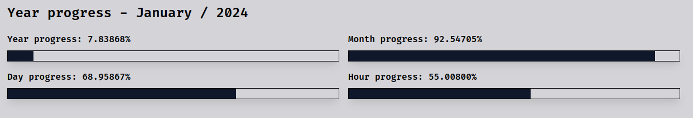

# Year progress



## Development Setup

1. **Prerequisites**
   - Node.js (version 20 or newer) installed: [https://nodejs.org/en/learn/getting-started/how-to-install-nodejs](https://nodejs.org/en/learn/getting-started/how-to-install-nodejs)
   - Basic understand of Next.js: [https://nextjs.org/](https://nextjs.org/)
   - pnpm package manager installed: [https://pnpm.io/installation](https://pnpm.io/installation)

> [!TIP]
> The project includes the `flake.nix` file for dependency management, enabling developers to leverage nix develop for a convenient development environment setup. You can use `nix develop` to enter development environment with out install prerequisites with [Nix](https://nixos.org/download)

2. **Clone the repository**

```bash
git clone https://github.com/2giosangmitom/year-progress.git
```

3. **Install dependencies**

```bash
pnpm install
```

4. **Run the development server**

```bash
pnpm dev
```

This will start the development server and open the application in your default web browser at `http://localhost:3000`.

## 🧞 Commands

All commands are run from the root of the project, from a terminal:

| Command           | Description                                            |
| ----------------- | ------------------------------------------------------ |
| `pnpm install`    | Installs project dependencies                          |
| `pnpm dev`        | Starts local development server on port 3000           |
| `pnpm build`      | Builds the production ready website                    |
| `pnpm start`      | Previews the built website locally                     |
| `pnpm check`      | Lints the project for code style and formatting issues |
| `pnpm fix`        | Automatically fixes linting issues if possible         |
| `pnpm test`       | Runs unit tests using Jest                             |
| `pnpm test:watch` | Runs unit tests in watch mode for continuous feedback  |
| `make build`      | Build Docker image                                     |
| `make run`        | Run application with Docker                            |
| `make stop`       | Stop Docker container                                  |
| `make remove`     | Remove Docker container                                |
| `nix develop`     | Enter development environment                          |
